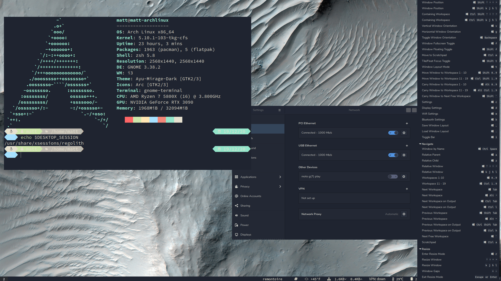

# regolith-de



Standalone Regolith desktop environment for Arch Linux

This is a PKGBUILD for Regolith Linux's fork of the i3 (plus Gnome-flashback) window manager/desktop environment, to rather hackily rip the desktop environment for Regolith Linux and make it work on Arch Linux and it's derivatives. 

Given that Regolith is based on Ubuntu, this will likely only be updated when new releases come out (20.04, 20.10, etc.), barring of course something breaks. But package versions will be taken from the "Release" branch of the Regolith PPA repo, as opposed to "Stable," "Unstable," or "Experimental." If that changes, it'll be noted in the README.

Where possible (more accurately, where I've found possible), Arch/AUR packages will be used if compatible versions exist. Currently Arch's i3-gaps, rofi, and some other packages are being used. Remontoire is in the AUR as `remontoire-git` and will need to be installed manually when using `makepkg` and not an AUR helper, as `makepkg` will *not* pull in dependencies from the AUR. This is why for the time being, `remontoire` is not listed as a hard dependency. It will likely be added when this goes live on the AUR. 

Because of the way AUR packages work, combined with Ubuntu-specific idiosyncracies in the original config file for Regolith's i3, I've had to bundle the regolith build of st - the simple terminal, and use that as the default terminal. Feel free to change it in the config file (`/etc/regolith/i3/config`) just like you would with regular i3, it's just the only other option was for there to be no default terminal, or else try and choose one that some people will have and others won't. I get around this by just including the terminal, and luckily it's st so it's really small. It's its own package, so you can also remove it (`sudo pacman -R regolith-st`), it's not a dependency of anything, it just gets installed with the meta-package. 

As of the latest update to Regolith proper, it seems that my package no longer conflicts with gnome-shell or GDM. If you have any issues let me know. 

## Contributing

PRs are welcome.

If you would like to test this PKGBUILD, the first steps would be to try it out in a Virtual Machine.

**Virtual Machine**

1. Spin up a new VM with a fresh install of Arch Linux.

2. Install git and download the source code for this repo.

    ```
    $ sudo pacman -Sy git
    
    $ mkdir -p ${HOME}/Downloads/build &&cd $_

    $ git clone https://github.com/gardotd426/regolith-de.git && cd regolith-de
    ```

4. [Install the packages](https://wiki.archlinux.org/index.php/Arch_User_Repository#Installing_and_upgrading_packages)

    ```
    $ makepkg -si
    ```
5. Install optional dependencies

    Until this PKGBUILD is live it isn't possible to include dependencies from the AUR. These will need to be installed manually while in testing.

    [Install the following from the AUR](https://wiki.archlinux.org/index.php/Arch_User_Repository#Installing_and_upgrading_packages) :
    - [remontoire-git](https://aur.archlinux.org/packages/remontoire-git/) - For the help overlay

6. Start Regolith Desktop Environment

    The best way obviously is through a display manager (DM). It definitely works with LightDM and SDDM, it should also work with GDM. Just select "Regolith" from the list of desktop environments.

    The other way is of course to run the session from a manual xorg startup:

    ```
    $ sudo pacman -Sy xorg-xinit

    $ echo 'exec regolith-session' > ${HOME}/.xinitrc

    $ startx
    ```

## Looks/Styles

   Regolith has a pretty cool (IMO) way of styles/theming, and I've kept all that intact. 
    
 - You can run `regolith-look` to get a list of commands, but basically, `regolith-look stage` will do the initial setup of copying the regolith and Xresouces files to your user directory (in their own, independent locations, so they will NOT overwrite ~/.Xresources or ~/.config/i3/config, they will go in ~/.Xresources-regolith and ~/.config/regolith/i3/config). 
    
 - To set your look, run `regolith look set <stylename>`, from the list of style directories in /etc/regolith/styles (also can be retrieved with `regolith-look list`), such as cahuella, lascaille (the default), ayu, ayu-dark, pop-os, ubuntu, etc.
 
 - `regolith-look refresh` will refresh it for your current session, changing the terminal theme, i3xrocks theme, and wallpaper (for the styles that have their own wallpaper). It's pretty simple. 

Note: VMs generally don't play well with picom/compton compositing. If you have any issues with performance, make sure to kill the compositor.

After extended testing, I'm prepared to say that this is ready for use. I will make it available in the AUR soon, I'm just waiting on something from upstream. But feel free to use it, it's fully functional and has been tested to my satisfaction.  


## Credits

Credit to Kevin Gilmer @kgilmer for the creation of Regolith Linux as well as invaluable insight during the creation of this PKGBUILD. 
Pull requests are welcome, the number of packages here is enormous (it is a full desktop environment, after all), and this is my first software/package management project of any kind. 

Much credit also to Avinash Duduskar, for already many contributions. 
